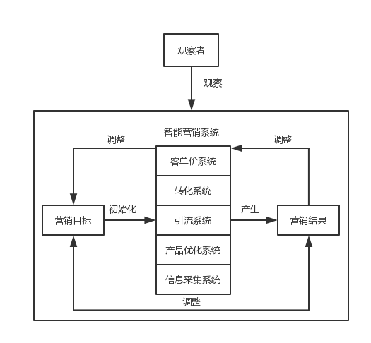

捡芝麻由几位营销老炮共同创立，专注于"技术流营销"与"套路化营销"。世上没有摇钱树，如果有，就是"营销技术"；赚钱没有捷径可走，如果有，就是"营销套路"。通过不断研究高效的营销技术、营销套路，并以此为基础建立营销系统，围绕着"产品优化"、"流量获取"、"流量转化"、"客单价提升"等几个主题，不断优化系统，最大化营销效果，这就是捡芝麻团队一直在做的事。

目前我们研发的自动引流系统，能够7*24小时全自动为我们获取目标客户，整个过程是无需人工干预的；自动客服机器人能够处理绝大部分客户诉求，帮助我们进行客户关系管理（Customer Relationship Management，CRM）。我们开发的营销系统是具备学习能力的，能在实践中不断"进化"。

下面进入捡芝麻创始人absfree的自（chui）白（niu）时间：

## 要想富，学技术
我在计算机技术领域，摸爬滚打了近10年，对于各主流技术方向均有涉猎，对各种底层技术做过"刨根问底"式的研究。缘起于中学时玩网络游戏，好奇游戏外挂的实现原理，此后对技术的热情一发不可收拾。在研究游戏外挂的过程中，几乎自学了大学计算机专业的所有课程，整个中学时代看过的计算机类书籍，摞起来应该比自己高得多：）

中学时期对计算机原理的探究到了"走火入魔"的地步，当时喜欢研究各种软件的实现原理，我对所研究软件的"解剖"程度是机器指令级的。当时一个朋友的电脑感染了某个十分"难缠"的病毒，尝试了多款杀毒软件未果，遂向我求助。我接手时，系统表现出的"中毒症状"很复杂，而且随机性比较强。在分析了半天无果后，我整理了思路，决定去系统底层找原因。我检查了系统用户层的运行时状态，又通过调试Windows内核观察内核的状态，寻找其中的异常点，不放过每一个细节。当我看到系统中存在的种种异常，很快理解了当时的中毒表现。接着通过修复系统的异常，完成了电脑的"解毒"。这个事情让我深刻认识到了：**要透过现象看到本质，当你认识到了问题的本质，离解决问题就不远了**。

整个中学时代对于计算机技术的学习，都围绕着"本质性的内容"，也就是操作系统、计算机体系结构、数据结构与算法等计算机专业基础课程。在这期间学习到的抽象、封装、分层等思想，对我日后构建的营销体系影响深远，在解决营销问题时，也会想方设法通过技术手段来提升效率。

对底层原理的"疯狂迷恋"，让我能看到大部分人注意不到的细节。

大学时为了彻底摸透某些Android应用的运行时行为，几个月时间废寝忘食，研究Android系统的源代码，并通过动态调试Android系统了解它的运行时细节。在这期间基于对Android系统的认识，开发了一个当时被我称为"AppObserver"的软件，它实现了一个完全仿真的Android运行环境，能够复现所有app的运行细节，最细的观察粒度达到了CPU指令级别。
（PS：最近听说阿里某实验室搞出了一个自动逆向机器人，号称世界领先，被他们当作战略级产品。根据公开信息，它的核心技术之一就是"复现app运行细节"，当然可能用了和我不同的方法来实现。）

## 要想富，玩套路
从小我就喜欢琢磨做各种事情的套路，我一直相信：**掌握了正确的做事套路，能够事半功倍**。比如我初中时琢磨的背英语单词的技巧：

<i>后来才知道，“联想记忆法”在古时就被发明了</i>

当时利用这个背单词的套路，我一天能背下其他人一周才能搞定的单词，这让我深切体会到了正确套路的强大力量。

除了背单词的套路，我在大学时还琢磨了挖软件漏洞的套路。利用这个套路，我找到了某著名小游戏网站的漏洞，影响范围达数百万人；还发现了学校教务系统数据库的漏洞，能够读取全部学生与教职人员的档案信息...为了防止被非法利用，我及时把上述漏洞提交给了某权威漏洞处理平台。

在大学尾声，萌生了帮助更多人学习技术的想法，于是准备在网络上发布原创技术教程。当时我希望自己的文章，在正确阐述技术概念的前提下，有较好的可读性，还想让更多人看到。于是我又琢磨了创作与传播技术性教程的套路，在半年时间发表了数十篇原创技术文章（主要围绕Java和Android）。其中的多篇被广泛转载，在全网总阅读量达到了上百万，收获了很多好评与鼓励。后来我的文章受到了人民邮电出版社的关注，邀请我将其整理成书出版。

<i>人民邮电出版社邀请出书</i>

## 套路玩得好，赚钱没烦恼
大学期间迫于生计，开始琢磨怎么赚钱，此时正式踏入了营销的坑。最开始做的是论文代写，用我自己琢磨的套路，一篇3万字的计算机专业论文平均10小时就能完成（包括各种图表绘制、格式修改等），在当时来说效率算是比较高了。

我当时的"套路"是产品思维和技术思维，产品思维体现在：针对实际需求（论文通过的标准），不断做减法（只写必要的内容）。技术思维体系在：为了提升图表绘制的效率，我开发了自动绘图工具，通过编写配置文件，能够自动生成配套的流程图、时序图、类图等，将绘图时间至少缩短了一半；同时为了提升校对论文格式的效率，对Word软件进行了逆向工程，在摸清了Word文件编码规律后，开发出了论文格式自动校对工具，能够按照预定义格式标准，同时对多篇论文的格式进行校对。论文代写这件事，让我体会到了：**掌握了先进的套路与技术，赚钱什么的根本不在话下**。做论文代写这件事，小小提升了当时的生活质量，还攒下了一小笔日后创业的本钱。

<i>当时一个学期的支付宝流水：开始自己赚钱后，过上了“腐败”的生活</i>

受思维惯性影响，我对于营销的学习与实践主要围绕着"本质性内容"，比如对人性的研究，获取与转化流量、提升客单价的方法论等。在这个过程中我逐步建立起了自己的营销体系，主要是产品开发、流量获取、流量转化、客单价提升四大方面。

多年的技术研究经验，让我喜欢用数据说话，相信营销中的一切元素都可以量化。结合自己对营销本质的理解，并借鉴计算机编程中经典的抽象、封装与分层思想，我创建了一套量化营销体系，我称之为"捡芝麻营销系统"。

## 质变引起量变
捡芝麻营销系统由观察者、智能营销系统、营销目标、营销效果等部分组成：

<i>捡芝麻营销系统</i>

（1）智能营销系统：具备"自我学习能力"（能够根据营销效果与营销目标间的偏差，进行自调整），量化了营销活动中的核心元素。一个智能营销系统实例，是对一次特定营销活动的抽象。智能营销系统由以下部分组成：
  a.客单价系统：目标是让单个客户价值最大化。手段不仅仅是提升产品定价，还包括让客户主动传播产品（裂变），甚至当代理一起卖产品。客单价系统的核心是我们独创的裂变体系。
  b.转化系统：目标是提升成交率（转化率），包括自动客服机器人、自动销售机器人等。
  c.引流系统：目标是最大化客流量获取，核心是自动引流系统、广告投放系统，涵盖了免费推广与付费推广两大方面。
  d.产品优化系统：基于筛选后的行业信息，完成产品开发与迭代。通过产品系统，能够短时间内拆解出竞品在流量获取、转化、提升收入方面的套路。基于竞品分析做出的产品，通常能集合其他竞品的优点，并避免常见缺点。
  e.信息处理系统：包括信息采集模块与信息筛选模块。信息采集模块从广泛的信息源中采集行业信息，交由信息筛选模块筛选出符合预定义规则的信息条目。筛选后信息条目主要是同行的赚钱模式与销售套路，以及互联网中存在的各种需求等，为产品优化提供参考。

（2）营销目标
每个智能营销系统实例都要依托一个具体的营销目标，可以看作是智能营销系统的上下文，通常根据营销目标完成智能营销系统实例的初始化。

（3）营销效果
营销效果是智能营销系统的输出结果，比如日引客流数、日成交率、产品好评率等量化数据都是营销效果的一部分。通常根据实时营销效果来动态调整智能营销系统，以期获得更好的营销效果。

（4）观察者
观察者通常是营销目标的制定者，智能营销系统的创建者。在整个系统中，观察者的职责是以"旁观者"的视角，客观的观察整个系统的运作，根据实时营销效果，手动调整智能营销系统与营销目标。

如果说智能营销系统是一个巨型机器，机器运转正常时，营销效果会很好；反之，如果某个零件出问题，就会对营销效果产生负面营销。当零件中存在杂质，导致"卡住了"，就会无法正常运转，这个影响零件运转的杂质我们称之为"芝麻"。对于芝麻，我们不仅要找到它们，还要拿来"榨油"，让机器的运转无比润滑，这样自然会产生好的营销效果。"芝麻"在实际营销活动中，就是常被人忽视的，却能很大程度影响营销结果的，处于本质层面的细节问题。

**以旁观者角度客观的观察营销活动，不断优化营销系统本质层面的细节，从而改善量化的营销结果（质变引起量变）**——我称之为"捡芝麻定律"。

## 芝麻开不开门
应用捡芝麻定律，就能芝麻开门吗？我真正意义上的第一桶金，是靠捡芝麻营销体系赚到的。当其他人刚刚意识到"这东西竟然也能赚钱"时，我早已经搭建好了"引流-转化-提客单价"的完整体系。赚取第一桶金这件事情上，进一步加深了我对营销本质的认识，同时意识到了想要做更多的事，还得组建自己的团队。于是联合几位好基友，来一起优化捡芝麻营销系统。

在这个过程中，我们通过捡芝麻系统，做成了更多的事：
1.初做国外广告联盟项目时，通过各种产品优化、转化与客单价套路，半个月收入超过5000刀
2.通过基于微信平台的裂变，近乎零成本，帮助某财经垂直类公众号一周涨粉2万以上（原本粉丝量7000左右）
3.每天花费1小时，10天完成15个百家号的转正，收益价值1万元以上（当时单个百家号转正号价值1000元左右）

我们深知对营销的探索永无止境，每当想起营销届的前辈曾经创下的种种奇迹，会更深刻意识到自身存在的诸多不足。希望和更多营销届的朋友产生连接，也期待和其他行业的朋友跨界交流，共同进步。想要同我们交流的朋友，请扫码关注公众号，并在后台留言，我们会在24小时内回复：）

<i>捡芝麻公众号</i>

